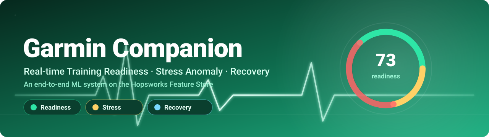
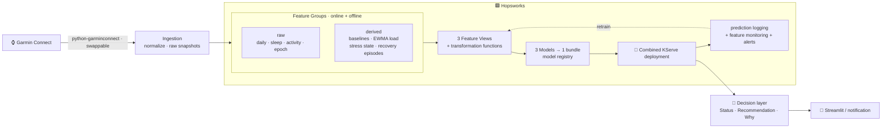
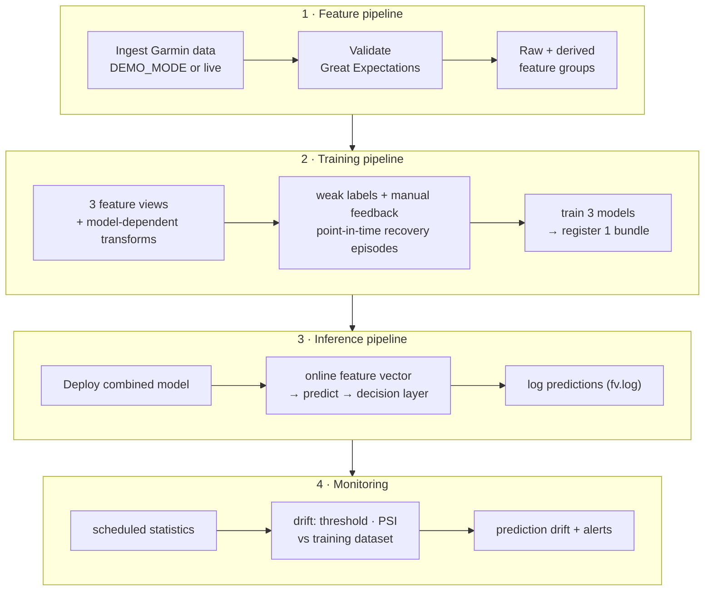
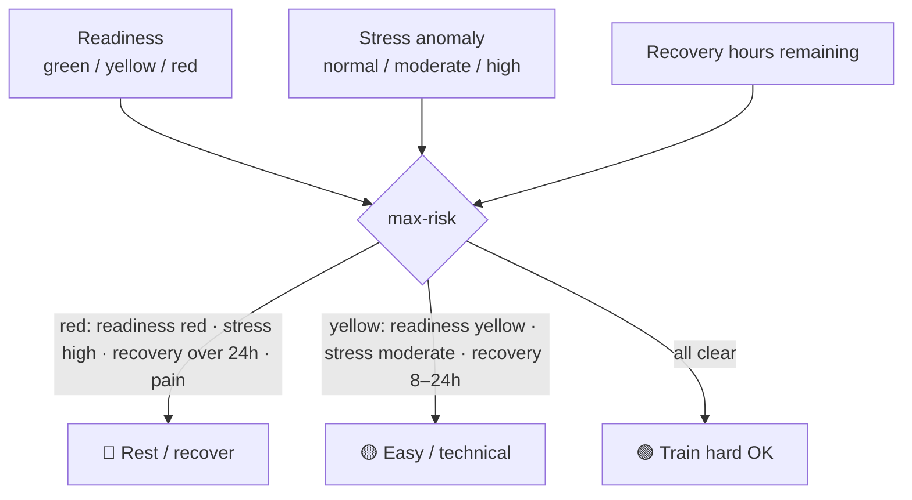

<p align="center">
  
</p>

<p align="center">
  
  
  
  
  
</p>

<h3 align="center">A Garmin-powered personal training-readiness, stress-anomaly &amp; recovery ML system — built end-to-end on Hopsworks.</h3>

<p align="center"><i>⚠️ Not medical advice. This is a personal training-readiness &amp; recovery <b>monitoring</b> system — not a diagnosis, injury-prediction, or clinical risk tool.</i></p>

---

## ✨ What it does

It turns your wearable data — sleep, HRV, resting HR, stress, Body Battery, and workouts — into **one daily recommendation**, with the reasons behind it:

```text
Status: 🟡 Yellow

Recommendation:
  Do mobility, easy zone 2, or technical practice today.
  Avoid max-effort intervals or hard lower-body work.

Why:
  • HRV is below your personal baseline
  • Post-workout recovery model estimates ~14h remaining
  • Stress anomaly is normal — so this is mostly training-load related
```

Three models cooperate behind a single recommendation:

| 🟢 Model | Problem | Approach |
|---|---|---|
| **Readiness** | Is today a hard / easy / recovery day? | rule (V0) → classifier on richer features |
| **Stress anomaly** | Is my stress pattern unusual *for this time of day*? | robust (median/MAD) z-scores → IsolationForest |
| **Recovery time** | How long until I'm recovered after a workout? | regression on point-in-time, censored episodes |

---

## 🏗️ Architecture



The whole system runs on Hopsworks primitives — **no bespoke validation, monitoring, or logging layer.** Every design choice was reviewed by a panel of Hopsworks experts; see **[`DESIGN_DECISIONS.md`](DESIGN_DECISIONS.md)**.

---

## 🔁 The FTI pipelines (notebook by notebook)



| Notebook | What you build |
|---|---|
| **`1_garmin_feature_pipeline.ipynb`** | Ingest & validate Garmin data; build raw + derived feature groups (as-of baselines, EWMA training load, realtime stress state). |
| **`2_garmin_training_pipeline.ipynb`** | Three feature views, weak readiness labels + manual feedback, point-in-time recovery episodes; train & register three models into one bundle. |
| **`3_garmin_inference_pipeline.ipynb`** | One combined KServe deployment: online feature fetch → three models → decision layer → prediction logging. |
| **`4_garmin_feature_monitoring.ipynb`** | Native feature monitoring (scheduled stats, threshold comparison, PSI vs. training dataset, prediction drift) + alerts. |

> 📊 Bonus: `streamlit run streamlit_garmin_app.py` for a live Status / Recommendation / Why dashboard.

---

## 🧠 The decision layer

The three models never contradict each other — a product-level **max-risk** layer combines them:



---

## 🚀 Quickstart

```bash
pip install -r requirements.txt
```

1. Get a free **[Hopsworks](https://app.hopsworks.ai)** account + API key.
2. Open the notebooks **in order** (`1 → 2 → 3 → 4`).
3. Data:
   - **`DEMO_MODE = True`** (default) → runs on bundled illustrative sample data, **no Garmin account needed**.
   - **`DEMO_MODE = False`** → pulls your own data via [`python-garminconnect`](https://github.com/cyberjunky/python-garminconnect) (export `GARMIN_EMAIL` / `GARMIN_PASSWORD`).

> The demo data is fabricated for illustration only — draw no health conclusions from it.

---

## ⚖️ Honest framing & limitations

This system is deliberately modest about what ML can do with one person's data:

- **The rule *is* the product (for now).** The readiness classifier is bootstrapped from a rule; trained on the same inputs it just re-learns the rule, so weak-label accuracy is *circular*. We evaluate against **manual feedback (Cohen's κ)** and lead with the rule + anomaly detector.
- **One user ≈ a few autocorrelated months** → far too little for calibrated boosted trees + SHAP. The entity model is **multi-user from day one** so the ML graduates with scale.
- **Recovery labels are a proxy**, defined against a *frozen pre-workout* baseline, with **censoring** handled explicitly — not a medical definition of recovery.
- **Body Battery & device training-load are themselves Garmin model outputs**, so we compute load ourselves and keep Body Battery out of the readiness model inputs to avoid circularity.

The full rationale (point-in-time correctness, train/serve skew, EWMA load, leakage traps, serving topology) lives in **[`DESIGN_DECISIONS.md`](DESIGN_DECISIONS.md)**. The original proposal is kept in [`garmin_hopsworks_recovery_ml_system_draft_report.md`](garmin_hopsworks_recovery_ml_system_draft_report.md).

---

## 🗂️ Repository layout

```text
garmin-companion/
├── 1_garmin_feature_pipeline.ipynb     2_garmin_training_pipeline.ipynb
├── 3_garmin_inference_pipeline.ipynb   4_garmin_feature_monitoring.ipynb
├── ingestion/        garmin_client.py · normalize.py · sample_data.py
├── features/         daily_summary · sleep · activity · epoch · baselines
│                     · training_load · recovery_episodes · weak_labels
├── transformations.py
├── deployments/      predictor.py · transformer.py
├── streamlit_garmin_app.py · requirements.txt
├── assets/banner.svg
└── DESIGN_DECISIONS.md · garmin_hopsworks_recovery_ml_system_draft_report.md
```

<p align="center"><sub>Built on the <a href="https://www.hopsworks.ai">Hopsworks</a> Feature Store · part of <a href="https://github.com/logicalclocks/hopsworks-tutorials">hopsworks-tutorials</a></sub></p>
